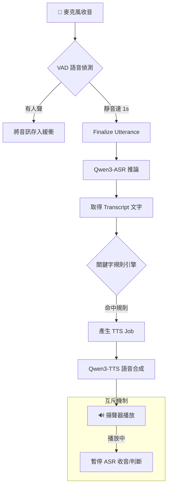

# 🎙️ 語音互動助理 (Voice-Activated Assistant)

這是一個基於 Python 開發的高效能、隱私優先的本地端語音代理系統。透過整合最新的 Qwen3 ASR 與 TTS 技術，實現流暢的語音指令識別與自動化回應。

---

> [!WARNING]
> **WSL 環境限制**：由於 WSL 預設無法存取 Windows 端的麥克風硬體，請務必在 **Windows 原生環境**（PowerShell/CMD）中執行本程式。如需在 WSL 中使用，請參考「常見問題」章節。

---


## ✨ 核心特性

- **🚀 極速本地推論**：使用 Qwen3-ASR 與 Qwen3-TTS，支援串流輸出，具備極低首包延遲。
- **🗣️ 純淨自然發音**：內建 OpenCC 簡繁轉換機制，避免 TTS 模型朗讀繁體中文時產生混淆（如自動切換為粵語口音），確保發音皆為標準的國語/普通話。同時排除帶有強烈方言口音的角色，保障溝通無礙。
- **🤫 隱私與安全**：語音轉文字 (ASR) 結果僅暫存於記憶體 (RAM)，程式結束後自動釋放，不留任何磁碟紀錄。
- **🧠 智慧停頓偵測 (VAD)**：內建 0.8 秒連續靜音判斷，精準識別一段話的結束點。
- **🚦 狀態機協調**：當 TTS 播放時自動暫停 ASR 監聽，完美解決「自己聽到自己講話」的自我回饋問題。
- **🛠️ JSON 驅動規則**：透過簡單的 JSON 設定檔定義關鍵字、優先序與多樣化的回覆模式。

---

## 🏗️ 技術架構

系統採用多執行緒非同步設計，確保音訊採集與 AI 推論互不干擾：

> 📦 **預覽須知**：本圖使用 Mermaid 語法繪製。若在 VS Code 中看不到圖示，
> 請安裝擴充套件 [Markdown Preview Mermaid Support](https://marketplace.visualstudio.com/items?itemName=bierner.markdown-mermaid)
> （搜尋 `bierner.markdown-mermaid`）後，重新開啟 Markdown Preview 即可正常顯示。



---

## 🛠️ 技術棧

- **語言**: Python 3.10+
- **ASR**: Qwen3-ASR (1.7B)
- **TTS**: Qwen3-TTS
- **VAD**: Silero VAD
- **併發**: Threading + Python Queue

---

## � 開發進度與計畫

專案採階段性開發，目前已完成核心架構的設計與初步實作。詳細的任務追蹤請參閱：

- [📝 專案待辦事項 (TODO.md)](TODO.md)：包含各階段 (Phase 1-8) 的詳細實作清單與驗收標準。
- [📄 產品需求文件 (PRD.md)](PRD.md)：系統架構與演算法細節的權威定義。

## 🚀 快速開始

### 1. 安裝依賴

```powershell
# 使用 uv（推薦）
uv sync

# 或使用 pip
pip install -r requirements.txt
```

### 2. 下載 ASR 模型（首次執行自動下載）

模型會在首次執行時自動下載（需要網路連線）：

```powershell
# 執行後會自動下載 Qwen3-ASR 模型（約 3-4GB）
python src/main.py --rules config/rules.json
```

若要手動預先下載：
```powershell
# 使用 transformers 庫下載模型
python -c "from transformers import AutoModelForSpeech2Seq; m = AutoModelForSpeech2Seq.from_pretrained('Qwen/Qwen3-ASR-0.6B', torch_dtype='float32', device_map='cpu')"
```

或直接從 Hugging Face 下載：
- [Qwen3-ASR-0.6B](https://huggingface.co/Qwen/Qwen3-ASR-0.6B)（較小，推薦）
- [Qwen3-ASR-1.7B](https://huggingface.co/Qwen/Qwen3-ASR-1.7B)（較大，但準確率更高）

### 2. 列出音訊設備

```powershell
python src/main.py --list-devices
```

### 3. 執行語音助理

```powershell
# 基本執行
python src/main.py --rules config/rules.json

# 指定音訊設備
python src/main.py --rules config/rules.json --device 0

# 指定運算裝置 (CPU 或 GPU)
python src/main.py --device-type cuda  # 強制 GPU
python src/main.py --device-type cpu   # 強制 CPU

# 切換語音人聲 (預設 vivian)
python src/main.py --voice random      # 啟動時隨機抽取一個聲音
python src/main.py --voice serena      # 切換為塞雷娜 (女聲)
python src/main.py --voice ryan        # 切換為瑞恩 (男聲)
python src/main.py --voice uncle_fu    # 切換為傅大叔 (特色聲)
# 註：為確保發音標準，已主動隱藏帶有四川與北京口音的方言角色。

# Mock 測試模式（不需要麥克風）
python src/main.py --mock-mode --test "天氣"
```

---

## ⚡ 推論引擎與加速指南 (進階)

我們建議進階使用者或擁有高速 GPU 的開發者安裝 **vLLM** 引擎。這能將語音推論的速度推向極致，解決預設 `transformers` 框架中的迴圈效能瓶頸。

### 為什麼不使用 `.bin` 格式 (CTranslate2 / faster-whisper) 加速？

在早期的計畫或是 Whisper 的使用生態中，通常會透過將模型轉換成 `.bin` 格式，交由 `faster-whisper` (底層依賴於 **CTranslate2 (CT2)**) 來進行極速推理。
* **CTranslate2 (CT2)**：這是一個專為標準 Transformer 架構設計的高效 C++ 推理引擎，特色是就算使用 CPU 也能跑得飛快。
* **無法使用的原因**：我們專案目前採用的是最新世代的 **Qwen3-ASR** 模型。這是一個「具備語音理解能力的大型語言模型變體 (Multimodal LLM)」，其架構不僅龐大，且包含許多特殊的結構 (需要 `trust_remote_code=True` 才能載入)。由於其**不是傳統的 Transformer 結構**，因此 **CTranslate2 目前尚未支援 Qwen3-ASR**。這就是為什麼我們無法像處理標準 Whisper 模型那樣，簡單把它轉成 `.bin` 格式。

### 所以我們如何讓 Qwen3-ASR 變快？(為什麼選擇 vLLM？)

既然無法走 `.bin` / CT2 這條路，Qwen 官方對於 Qwen3 系列強烈建議使用的唯一終極加速方案就是：**vLLM**。
1.  **🚀 推理速度提升 3~5 倍**：vLLM 是專為大型語言模型 (LLM) 推理設計的高效能 C++ 引擎。
2.  **🌌 PagedAttention 技術**：有效管理 KV Cache 記憶體，降低 OOM 風險。
3.  **🚄 官方最佳支援**：Qwen 官方對於 Qwen3-ASR 系列強烈推薦使用 vLLM backend。
4.  **🌊 真正的非同步串流**：vLLM 引擎原生支持極低延遲的串流生成，這是 `Qwen3-TTS` 等模型達到「即時反應」的關鍵。

### 安裝 vLLM

請在虛擬環境 (如 `.venv`) 中執行以下安裝指令：

```powershell
uv pip install vllm
# 或使用標準 pip
# pip install vllm
```

*(註：Windows 上安裝 vLLM 可能需要準備 C++ 建置工具與 CUDA Toolkit，若不熟悉編譯流程，可繼續使用免編譯的預設 Transformers 引擎。)*

---

## 🔧 常見問題

### Q1: WSL 環境無法使用麥克風

**問題**：在 WSL 中執行時顯示 `PortAudioError: Error querying device -1`

**原因**：WSL 預設無法直接存取 Windows 主機的麥克風

**解決方案**：

1. **推薦**：在 Windows 原生環境執行（PowerShell/CMD）
   ```powershell
   cd D:\github\chiisen\voice-activated-assistant.py
   python src\main.py --rules config\rules.json
   ```

2. **或設定 WSL 音訊**（進階）：
   ```bash
   # 在 WSL 中安裝
   sudo apt install libasound2-plugins pulseaudio
   ```

### Q2: `ModuleNotFoundError: No module named 'numpy'`

**解決方案**：
```powershell
# 安裝依賴
pip install -r requirements.txt
# 或
uv sync
```

### Q3: `uv sync` 錯誤 - 存取被拒

**問題**：Windows 檔案權限錯誤

**解決方案**：
```powershell
# 刪除舊的虛擬環境
Remove-Item -Recurse -Force .venv

# 重新安裝
uv sync
```

### Q4: TTS 無法發聲

**檢查**：
1. 確認系統音量已開啟
2. Windows 可用 `pyttsx3`（內建 Edge TTS）
3. Linux 可用 `espeak-ng`（已安裝）

---

## 📖 使用說明

### 指令列選項

| 選項 | 說明 |
|------|------|
| `--rules <path>` | 規則檔路徑（預設：config/rules.json） |
| `--list-devices` | 列出可用音訊設備 |
| `--device <n>` | 指定音訊設備編號 |
| `--mock-mode` | Mock 模式，不需要麥克風 |
| `--test <文字>` | 測試特定關鍵字（自動啟用 mock 模式） |
| `--debug` | 啟用偵錯模式 |

### 規則檔格式

編輯 `config/rules.json` 來新增/修改關鍵字回應：

```json
{
  "rules": [
    {
      "id": "greeting",
      "keywords": ["你好", "hello"],
      "match_mode": "contains",
      "priority": 1,
      "cooldown_s": 2.0,
      "response": {
        "type": "speak_text",
        "text_template": "你好，我是語音助理"
      }
    }
  ]
}
```

---

<!-- [😸SAM] -->
